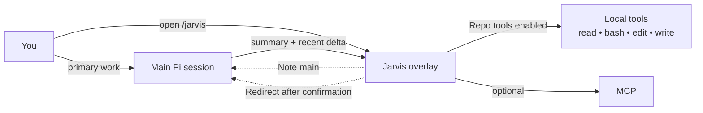
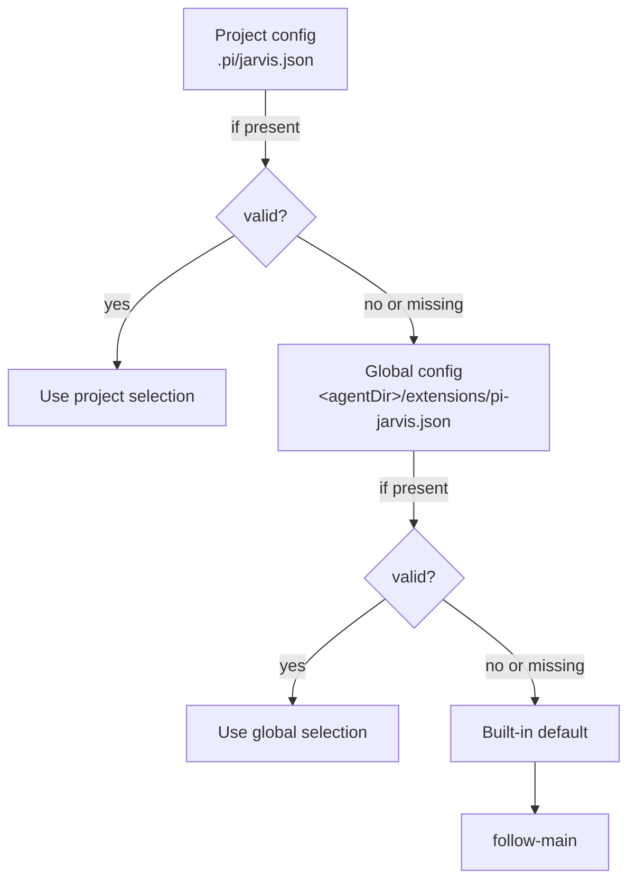
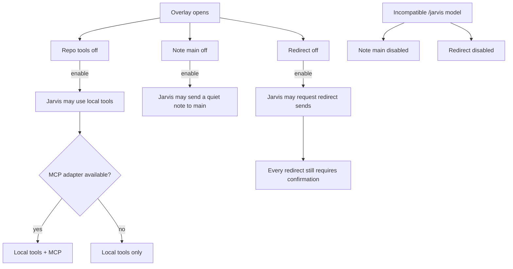
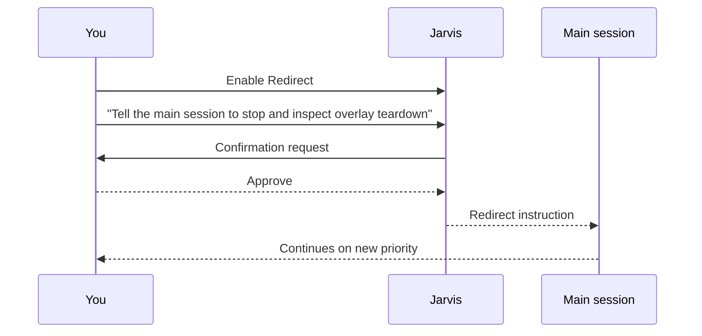

# pi-jarvis

<div align="center">

## A cinematic side-conversation overlay for Pi

**Open a second lane of thought without derailing the main session.**

`pi-jarvis` adds `/jarvis`: a polished overlay where you can ask for status, inspect the repo when you explicitly allow it, and send a quiet note or a confirmed redirect back to the main lane.

[](https://www.npmjs.com/package/pi-jarvis)
[](./LICENSE)
[](https://github.com/fluxgear/pi-jarvis)
[](./package.json)

<p>
  <strong>Persistent side session</strong> ·
  <strong>Live main-session awareness</strong> ·
  <strong>Permission-gated tools</strong> ·
  <strong>Safe redirect flow</strong>
</p>

</div>

---

## The pitch

The main Pi session should stay on the critical path.

`/jarvis` gives you a **second cockpit** for the work that should not interrupt that primary flow:

- checking what the main agent is doing right now
- seeing what changed since the last `/jarvis` turn
- asking for triage, summaries, or a second opinion
- inspecting the repo with local tools when you turn them on
- sending a non-interrupting note back to the main session
- redirecting the main session only after explicit confirmation

> Think of it as a side conversation with real context, not a detached scratchpad.

### Typical prompts

- *"What is the main agent doing right now?"*
- *"Summarize the last validation failure and tell me what matters."*
- *"Check this file while the main session keeps moving."*
- *"Compare what changed since my last `/jarvis` turn."*
- *"Redirect the main session, but make me confirm it first."*

---

## At a glance

| Capability | What you get |
|---|---|
| **Persistent side lane** | `/jarvis` keeps its own isolated conversation state and restores prior side-session history |
| **Live awareness** | Jarvis sees the current main-session summary plus a delta since the last `/jarvis` turn |
| **Permission-gated tools** | Local `read`, `bash`, `edit`, `write`, and optional `mcp` stay off until you enable them |
| **Safe main-session handoff** | `Note main` is quiet; `Redirect` is confirmation-gated |
| **Independent model control** | Follow the main model or pin `/jarvis` to a separate model |
| **Cleaner UX** | Thinking-step streaming is collapsed into a cleaner animated fallback |

---

## How it fits into Pi



### Operating model

```mermaid
flowchart TD
    A[Main session keeps moving] --> B[/jarvis opens in overlay]
    B --> C[Jarvis sees current main-session context]
    C --> D{What do you need?}
    D -->|Status / summary / analysis| E[Jarvis handles the side task]
    D -->|Repo inspection| F[Enable Repo tools]
    D -->|Influence the main lane| G[Enable Note main or Redirect]
    G --> H{Redirect?}
    H -->|Yes| I[Per-send confirmation]
    H -->|No| J[Quiet follow-up note]
```

---

## Why use `/jarvis` instead of the main lane?

Use `/jarvis` when you want:

- a second opinion without changing the primary plan yet
- a quick repo inspection while the main agent keeps moving
- a compact explanation of current progress or validation state
- a controlled way to send guidance back to the main session

Stay in the main lane when you want:

- the main plan to change immediately
- the main session itself to execute the next step directly
- no side conversation overhead at all

---

## Quick start

### 1) Install

```bash
npm install pi-jarvis
```

### 2) Register the extension in Pi

Use the package's published extension entrypoint:

```text
./dist/index.js
```

This package is meant to run **inside a Pi installation** that provides the required peer dependencies.

### 3) Open Jarvis

```bash
/jarvis
```

Or open it and send the first message immediately:

```bash
/jarvis summarize the last validation failure and suggest the fastest next move
```

### 4) Turn on more power only when you want it

- leave `Repo tools` off for pure context / analysis
- turn `Repo tools` on when you want local `read`, `bash`, `edit`, `write`, and optional `mcp`
- turn `Note main` on when you want Jarvis to quietly message the main session
- turn `Redirect` on when you want Jarvis to propose a redirect that you still explicitly confirm

---

## Command surface

### `/jarvis`
Opens the side overlay. If text follows the command, that text becomes the first side-session prompt.

### `/jarvis-model`
When Pi has a UI, running `/jarvis-model` with no argument opens a model picker instead of requiring an exact provider/model string.

### `/jarvis-model [--project|--global] <provider/model>`
Pins `/jarvis` to a specific model without changing the main session model. A plain `/jarvis-model <provider/model>` writes a **project-local** override to `.pi/jarvis.json`.

### `/jarvis-model [--project|--global] follow-main`
Restores the chosen scope to `follow-main`. A project-scoped `follow-main` override still wins over a global pinned setting.

### `/jarvis-model [--project|--global] clear`
Removes the selected scope so `/jarvis` falls back through the remaining config layers to the built-in default.

### `/jarvis-thinking [--project|--global] auto|follow-main|off|minimal|low|medium|high|xhigh`
Sets the thinking level used by `/jarvis` without changing the main session thinking level. A plain `/jarvis-thinking <level>` writes a **project-local** override to `.pi/jarvis.json`.

- `auto` preserves the built-in behavior: follow the main thinking level only when `/jarvis` follows the main model; pinned `/jarvis` models use `off`.
- `follow-main` follows the main thinking level even when `/jarvis` is pinned to a separate model.
- Explicit levels pin `/jarvis` thinking to that level.
- xAI `/jarvis` models still force thinking `off`.

### `/jarvis-thinking [--project|--global] clear`
Removes the selected scope so `/jarvis` thinking falls back through the remaining config layers to the built-in `auto` default.

### Side-session commands inside `/jarvis`
The `/jarvis` input handles a small set of built-in commands against the isolated side-session:

- `/compact [instructions]` compacts the `/jarvis` conversation context.
- `/tree` prints the `/jarvis` session tree with entry IDs.
- `/tree <entry-id>` navigates the `/jarvis` session tree to that entry.
- `/tree --summarize <entry-id> [instructions]` navigates and summarizes the branch being left.
- `/new` starts a fresh `/jarvis` side-session without changing the main Pi session.

---

## Model and thinking resolution



### Resolution order

Both model and thinking settings resolve through the same config layers:

1. project config: `.pi/jarvis.json`
2. global config: `~/.pi/agent/extensions/pi-jarvis.json` or the equivalent path under a custom Pi agent dir
3. built-in defaults: model `follow-main`, thinking `auto`

---

## Overlay controls

The overlay header exposes three controls, all **off by default**:

| Control | What it does | Safety model |
|---|---|---|
| `Repo tools` | Enables local `read`, `bash`, `edit`, `write`, and optional `mcp` | Explicit opt-in |
| `Note main` | Sends a concise, non-interrupting note to the main session | Explicit opt-in |
| `Redirect` | Sends a redirecting instruction to the main session | Explicit opt-in + per-send confirmation |

`Note main` and `Redirect` can be forcibly disabled when the active `/jarvis` model is incompatible with bridge tools.

### Permission flow



---

## Redirect flow



---

## Session behavior

- `/jarvis` keeps its own isolated conversation state
- prior side-session history is restored from a session file under `jarvis-sessions/`
- Jarvis sees current main-session state plus a compact delta since the last `/jarvis` turn
- `/compact`, `/tree`, and `/new` entered inside `/jarvis` operate on the side-session, not the main session
- plain `/jarvis-model <provider/model>` writes the project model override; use `--global` to change the global default
- plain `/jarvis-thinking <level>` writes the project thinking override; use `--global` to change the global default
- thinking-step streaming is intentionally collapsed to a cleaner animated fallback for readability

---

## Example usage

### Ask for live status

```bash
/jarvis what is the main agent doing right now?
```

### Ask for triage while the main lane keeps moving

```bash
/jarvis summarize the last failing test and tell me the fastest likely fix
```

### Use Jarvis as a repo-side helper

```bash
/jarvis inspect overlay.ts for teardown or redraw risks
```

### Send a non-interrupting note back to the main session

1. Open `/jarvis`
2. Enable `Note main`
3. Ask Jarvis to send the note

### Send a redirect safely

1. Open `/jarvis`
2. Enable `Redirect`
3. Ask Jarvis to redirect the main session
4. Confirm the send

---

## Compatibility note

This repository's current validation baseline is **Pi 0.69.0**.

The package relies on Pi-provided peer dependencies, so treat other host versions as **not the validated baseline for this repo** unless you have tested them yourself.

---

## Development

Install dependencies:

```bash
npm install
```

Type-check:

```bash
npm run check
```

Run tests:

```bash
npm test
```

Build the published package contents:

```bash
npm run build
```

Preview the npm payload:

```bash
npm pack --dry-run
```

---

## License

`pi-jarvis` is released under the **MIT License**. See [LICENSE](./LICENSE).
